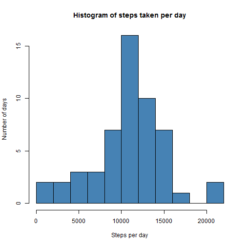
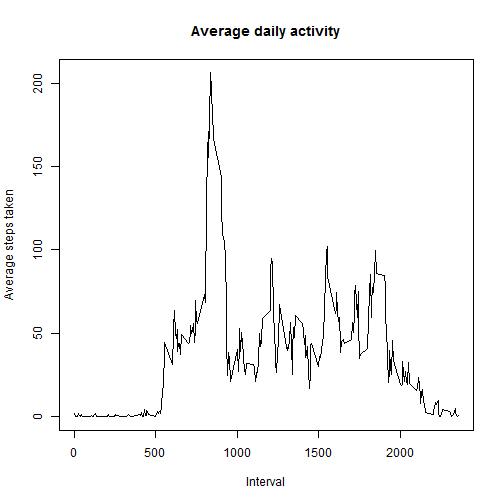
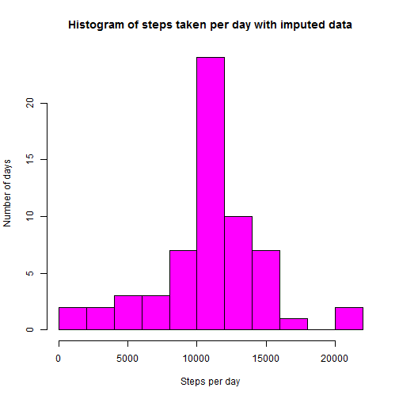
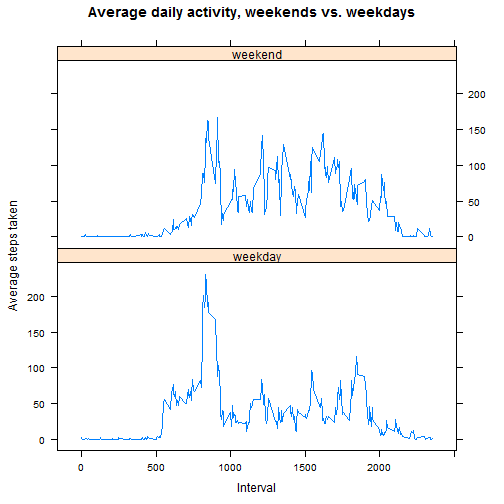

Reproducible Research Assignment 1
========================================================

This document contains an analysis of the Activity monitoring data dataset according to the specifications set out in the first peer assessment assignment for the **Reproducible Research** course on Coursera.

## Loading and preprocessing the data

Assuming that the R working directory contains the file *activity.csv* which is the object of this analysis, this data file should be opened with R as follows and read into a variable *df*. No further preprocessing of the dataset is necessary at this point.


```r
df <- read.csv("activity.csv")
```

## What is mean total number of steps taken per day?

The following histogram shows the total number of steps per day. Note that the data set contains data points where the number of steps (i.e. the *steps* column of the *df* data frame) is NA. For days with such missing data points the *sum* function returns NA, and these days are automatically ignored in the following histogram (rather than represented as days with 0 steps taken, for instance).


```r
daily <- aggregate(df$steps, by=list(df$date), sum)
hist(daily$x, breaks = 10, xlab="Steps per day", ylab="Number of days", main ="Histogram of steps taken per day", col="steelblue")
```

 

The mean number of steps per day can be calculated with the following formula and yields the following result:


```r
mean(daily$x, na.rm=TRUE)
```

```
## [1] 10766
```

Similarly for the median number of steps:


```r
median(daily$x, na.rm=TRUE)
```

```
## [1] 10765
```

Notice that the mean and median values are extremely close.

## What is the average daily activity pattern?

Let us now examine the average number of steps taken for every 5 minute interval of each day, averaged across all days. First the average values are calculated using the aggregate function, and then the result is plotted.


```r
avsteps <- aggregate(df$steps, by=list(df$interval), mean, na.rm = TRUE)
plot(avsteps, type="l", xlab="Interval", ylab="Average steps taken", main="Average daily activity")
```

 

It is clearly visible that by far the most active part of the day is just before 10 AM. The following lines display the interval with the highest average number of steps:


```r
avsteps[avsteps$x == max(avsteps$x),]
```

```
##     Group.1     x
## 104     835 206.2
```

The most active interval is the one between 8:35 and 8:40 AM with an average number of 206.2 steps taken.


## Imputing missing values

As mentioned before, there is a certain number of data points in the data set where the number of steps taken is missing for a given interval. One way to find the number of missing values is as follows:


```r
nrow(df[is.na(df$steps),])
```

```
## [1] 2304
```

I will impute these 2304 missing values now using a very simple method. I create a vector containing the rounded mean of each 5 minute interval, add this vector as a new column *(roundsteps)* to a copy of the original data frame, and then overwrite each NA value in the *steps* column by the number that is contained in this new column in the respective line.


```r
roundsteps <- round(avsteps$x)
roundsteps <- rep.int(roundsteps, 61)
df2 <- df
df2 <- cbind(df2, roundsteps)
df2[is.na(df2$steps),1] <- df2[is.na(df2$steps),4]
```

The resulting data frame df2 does not contain any NA values, as a quick check shows:


```r
summary(df2)
```

```
##      steps               date          interval      roundsteps    
##  Min.   :  0.0   2012-10-01:  288   Min.   :   0   Min.   :  0.00  
##  1st Qu.:  0.0   2012-10-02:  288   1st Qu.: 589   1st Qu.:  2.75  
##  Median :  0.0   2012-10-03:  288   Median :1178   Median : 34.50  
##  Mean   : 37.4   2012-10-04:  288   Mean   :1178   Mean   : 37.37  
##  3rd Qu.: 27.0   2012-10-05:  288   3rd Qu.:1766   3rd Qu.: 53.00  
##  Max.   :806.0   2012-10-06:  288   Max.   :2355   Max.   :206.00  
##                  (Other)   :15840
```

Now we can repeat the analysis steps that were carried out for the original *df* data frame which contains NA values.

First the histogram based on the daily sums:


```r
daily2 <- aggregate(df2$steps, by=list(df2$date), sum)
hist(daily2$x, breaks = 10, xlab="Steps per day", ylab="Number of days", main ="Histogram of steps taken per day with imputed data", col="magenta")
```

 

Then the mean and median:


```r
mean(daily2$x, na.rm=TRUE)
```

```
## [1] 10766
```

```r
median(daily2$x, na.rm=TRUE)
```

```
## [1] 10762
```

The mean and median are almost exactly identical to the values found in the original data set. The histogram is also very similar, but there is an important difference: the number of days with around 10000-12000 steps has increased strongly, from about 15 to about 25. All other parts of the histogram appear identical to the earlier version.

## Are there differences in activity patterns between weekdays and weekends?

In order to examine whether there is a difference in activity patterns between weekdays and weekends, I create first a character vector of weekdays from the *date* column of the *df2* data set:


```r
Sys.setlocale("LC_TIME", "English")
```

```
## [1] "English_United States.1252"
```

```r
wkday <- weekdays(as.Date(as.character(df$date)))
```

Then I rename the values "Saturday" and "Sunday" to "weekend", and all other values to "weekday", and finally transform the resulting vector to a factor (with these two levels):


```r
wkday[substr(wkday,1,1) == "S"] <- "weekend"
wkday[wkday != "weekend"] <- "weekday"
wkday <- factor(wkday)
```

Next I calculate the means for the numbers of steps for each interval, across weekdays and weekends respectively, using the aggregate function:


```r
avstepspart <- aggregate(df2$steps, by=list(df2$interval, wkday), mean)
```

Using the **lattice** package to plot the resulting table we get the following diagram:


```r
library(lattice)
xyplot(x ~ Group.1 | Group.2, avstepspart, type="l", layout=c(1,2), xlab="Interval", ylab="Average steps taken", main="Average daily activity, weekends vs. weekdays")
```

 

The plots show a clear difference between weekdays and weekends: On weekdays there is one very high peak around 9 AM and several much lower peaks around noon, 4 PM and 6 PM. There is also much activity between 5 AM and 9 AM. On weekends there is hardly any activity before roughly 8 AM, and although there is still a peak around 9 AM, it is much lower than on weekdays, and there are many similarly high peaks visible throughout the day. There is much more activity just after 8 PM than on weekdays.
